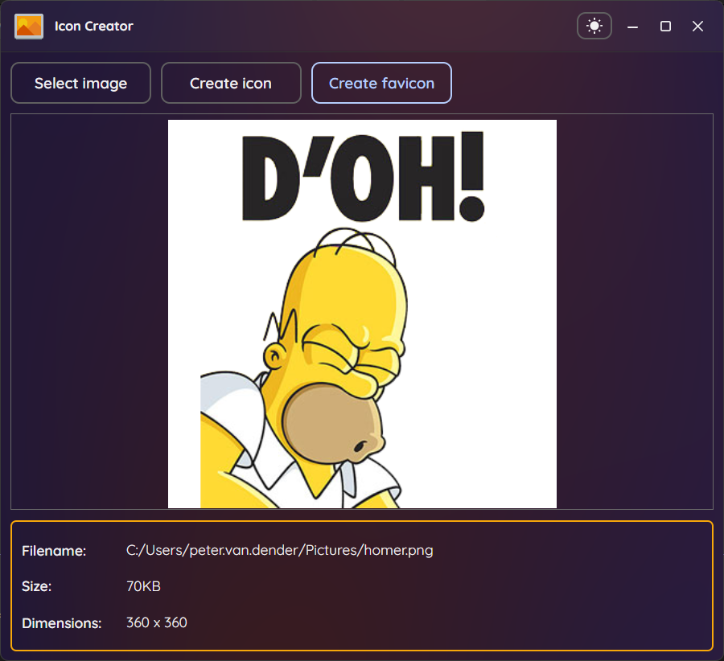

# IconCreator

A cross-platform desktop application for creating `.ico` icon files from images. Built with [Avalonia UI](https://avaloniaui.net/) and [SukiUI](https://github.com/kikipoulet/SukiUI).



## Features

- Create multi-size `.ico` files (16x16 through 256x256)
- Create favicon `.ico` files (16x16)
- Supports PNG, JPEG, BMP, TIFF, and GIF source images
- Light/dark theme toggle
- Cross-platform (Windows, Linux, macOS)

## Requirements

Source images must be square and at least 256x256 pixels.

## Download

Pre-built binaries are available on the [Releases](https://github.com/Tenera/IconCreator/releases) page.

## Building from source

Requires [.NET 10 SDK](https://dotnet.microsoft.com/download).

```bash
dotnet build src/IconCreator/IconCreator.csproj
```

## License

[MIT](LICENSE)
